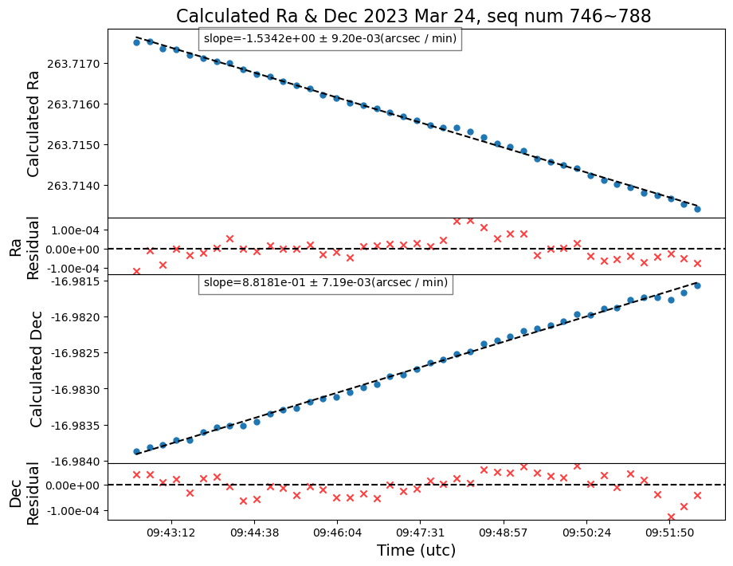
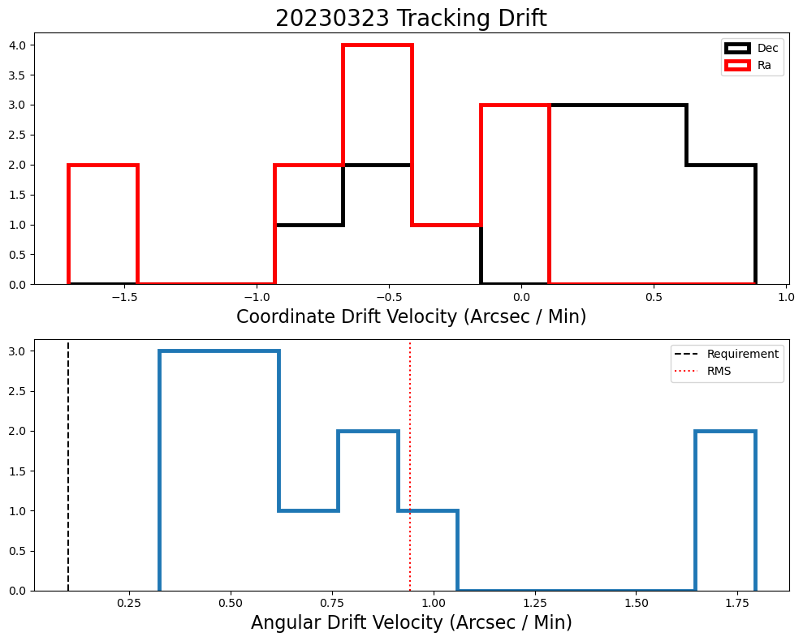

:tocdepth: 1

.. sectnum::

.. Metadata such as the title, authors, and description are set in metadata.yaml

Abstract
========

This technote shows analysis of the drift during tracking.
Drift during tracking uses the following files in `lsst-sitcom/notebooks_vandv <https://github.com/lsst-sitcom/notebooks_vandv/>`__
in the ``notebooks/tel_and_site/subsys_req_ver/tma/`` directory:
- ``LVV-T2738-ST_PTT_Tracking_drift_check.ipynb``

.. code-block:: python

   print('hello world!')

Methodology
================

The goal of this study was analyze the drift rate while tracking in March 2023. 
This was done using the RA and DEC data in RubinTV. 

This analysis was done for the data taken while tracking testing was done on 2023/03/09.

Results
================

We ran the notebook to take 1800 images each from all 3 generic cameras (startrackers and DIMM camera) while tracking, on 2023/03/09. 

Figure 1.  Calculated RA and DEC and residuals during the tracking.

Figure 2.  Coordinate Draft velocity and Angular Draft Velocity Histograms

Summary
==========================

This technote shows a summary of the RA and DEC drifts during the tracking